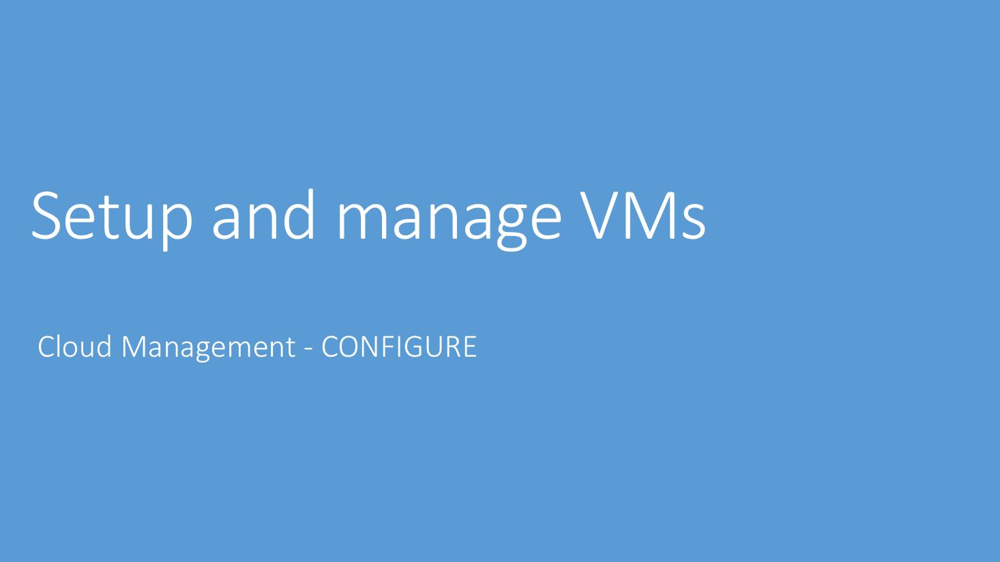

<!--slide2-->
# Enterprise IT is transforming

***

<!--slide3-->
# Every cloud customer needs security & management

***

<!--slide4-->
# Modern tools across the lifecycle

***

<!--slide5-->

***

<!--slide6-->
# Configuration Demo Script (1)
## PowerShell in Azure Cloud Shell

* I can get a shell experience of my liking - **PowerShell** or **Bash** natively in the Azure Portal (or [full screen](https://shell.azure.com)) via the **Cloud Shell**. 
    * This essentially enables an authenticated shell experience from virtually anywhere.
  
* I can **easily navigate** all my Azure resources as if I am navigating filesystem. And I can take action against them using familiar PowerShell cmdlets
    * Your investment in PowerShell easily transfers from on-prem to the Cloud
***

<!--slide7-->
# Demo Overview
 ***Prework:*** *Open PowerShell from the [drop-down](/pptimages/Slide7pic1.JPG) in the Cloud Shell in the portal (before the session), wait for the prompt and close it. Opening again during the demo will be fast. [Increase the font size through selector](/pptimages/Slide7pic2.JPG)*
  
## Demo
1. Open PowerShell in Cloud Shell
2. List all the subscriptions
    * **dir (or ls)**
3. Go to a specific subscription – ‘Contoso IT – demo’ and list the resources
    * **cd con<tab>**
    * **dir (or ls)** - 
  **Talking Point:** You will notice there are multiple views for your Azure resources 
4. Go to VirtualMachines, list them and group them by location
    * **cd vir<tab>** - 
  **Talking Point:** Tab allows me to type as minimum as required
    * **dir** - 
  **Talking Point:** Fetches live info from service, subsequent calls are cached. –Force overrides the cache
    * **dir | group location**
5. List all the commands that are available to you
    * **get-command | measure** - 
  **Talking Point:** Hundreds & Thousands of commands are built-in for you 
    * **get-command**
6. Use existing commands to take actions ([Azure drive allows easy navigation](/pptimages/Slide7pic3.JPG))
* **New-AzureRmResourceGroup –Name zMyRG –Location westus**
7. Easily open the Cloud Shell in full screen mode (no portal distractions)
***

<!--slide8-->
# Configuration Demo Script (2)
## Azure VM Configuration and Patch Management
1. Use “Inventory” to check the Java version. You know you patched last week, it should have latest version. So, you want to know how the change happened
2. Go to “Change tracking” to track the change and find out that to see it has been downgraded
    *  *Why would someone downgrade the Java package? Story is that developer downgraded it because of some app compatibility issue which is not working on the new package version and that they needed it on the lower version while awaiting a fix.*
3. Go to “Update management” on that VM and show that in “missing updates”, you can see this java package missing critical update (additional validation). 
4. Go to “Manage multiple computers” from single VM, show “Schedule Update deployment”, talk about options

| **VM Name**           | **OS**| **Status**  |
| ----------------------|:-----:| :-----------|
| **ContosoWeb2-Linux** | Linux | Onboarded to Update/Change/Inventory and fully functional|
***

<!--slide9-->
1. Click on “Inventory” in the TOC
2. Type “java” into the search bar.
3. Click on the out-dated “java-1.7.0-openjdk” (version with 151 in it) record to see what other machines have that version

**Talking Points:**
* Inventory allows users to view the configurations of their computers without connecting into the machines.
* We can see multiple versions of java-1.7.0 are installed. This is suggests that the version was changed.
* Let’s go to Change Tracking to see if we can see more about what happened.
***