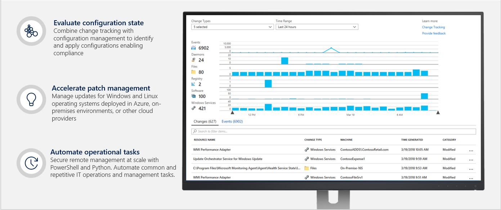

<!--slide1-->

***

<!--slide2-->
# Enterprise IT is transforming

***

<!--slide3-->
# Every cloud customer needs security & management

***

<!--slide4-->
# Modern tools across the lifecycle

***

<!--slide5-->

***

<!--slide6-->
# Setup and manage VMs
## [Azure Configuration & Automation]()

***

<!--slide7-->
# Configuration Demo Script (1)
## PowerShell in Azure Cloud Shell

* I can get a shell experience of my liking - **PowerShell** or **Bash** natively in the Azure Portal (or [full screen](https://shell.azure.com)) via the **Cloud Shell**. 
    * This essentially enables an authenticated shell experience from virtually anywhere.
  
* I can **easily navigate** all my Azure resources as if I am navigating filesystem. And I can take action against them using familiar PowerShell cmdlets
    * Your investment in PowerShell easily transfers from on-prem to the Cloud
***

<!--slide8-->
# Demo Overview
 ***Prework:*** *Open PowerShell from the drop-down in the Cloud Shell in the portal (before the session), wait for the prompt and close it.*
 ###  
  *Opening again during the demo will be fast. Increase the font size through selector.*
  
## Demo
1. Open PowerShell in Cloud Shell
2. List all the subscriptions
    * **dir (or ls)**
3. Go to a specific subscription – ‘Contoso IT – demo’ and list the resources
    * **cd con<tab>**
    * **dir (or ls)** - 
4. Go to VirtualMachines, list them and group them by location
    * **cd vir<tab>** - 
    * **dir** - 
    * **dir | group location**
5. List all the commands that are available to you
    * **get-command | measure** - 
    * **get-command**
6. Use existing commands to take actions (Azure drive allows easy navigation )
* **New-AzureRmResourceGroup –Name zMyRG –Location westus**
7. Easily open the Cloud Shell in full screen mode (no portal distractions)
***

<!--slide9-->
# Configuration Demo Script (2)
## Azure VM Configuration and Patch Management
1. Use “Inventory” to check the Java version. You know you patched last week, it should have latest version. So, you want to know how the change happened
2. Go to “Change tracking” to track the change and find out that to see it has been downgraded
    *  *Why would someone downgrade the Java package? Story is that developer downgraded it because of some app compatibility issue which is not working on the new package version and that they needed it on the lower version while awaiting a fix.*
3. Go to “Update management” on that VM and show that in “missing updates”, you can see this java package missing critical update (additional validation). 
4. Go to “Manage multiple computers” from single VM, show “Schedule Update deployment”, talk about options

| **VM Name**           | **OS**| **Status**  |
| ----------------------|:-----:| :-----------|
| **ContosoWeb2-Linux** | Linux | Onboarded to Update/Change/Inventory and fully functional|
***

<!--slide10-->
1. Click on “Inventory” in the TOC
2. Type “java” into the search bar.
3. Click on the out-dated “java-1.7.0-openjdk” (version with 151 in it) record to see what other machines have that version

**Talking Points:**
* Inventory allows users to view the configurations of their computers without connecting into the machines.
* We can see multiple versions of java-1.7.0 are installed. This is suggests that the version was changed.
* Let’s go to Change Tracking to see if we can see more about what happened.
***

<!--slide11-->

**Talking Points**
* From here, you can see which other machines also have this outdated version of Java
***

<!--slide12-->
1. Click on “Change Tracking” in the TOC
2. Search for java in the list of changes
3. Click on the change record for the software record about java-1.7.0-open-jdk
   

**Talking Points**
* Interactively troubleshoot and view the changes affecting your computer
* We can see that the java package was modified recently.
* We can click on the record to drill down into what properties were changed in this modification.
***

<!--slide13-->
1. Click x in the top right corner to leave this view
   

**Talking Points**
* The version changed from .171 to .151. This verifies our assumption from Inventory.

 
***

<!--slide14-->
1. Click on the “Events” tab for the table below the main visualization to see the list of events. 

**Talking Points**
* We can see the there were Azure activity events that occurred around the same time as the change.
* A custom extension called “downgrade_java” was added by “jehunte@microsoft.com”. We now know who most likely made the change and how they did it.
***

<!--slide15-->
1. Click “Update management” in the TOC.
2. Note that the java package is in the list.
3. Click “Manage multiple machines” at the top.

**Talking Points**
* On the main update screen, we can see extra validation that our java package is out of date. 
* We can also see that the publisher labeled this as a critical update.
***

<!--slide16-->
1. Click “Schedule update deployments”

**@scale Update management talking points**
* Compliance overview
* Four tabs: Machines, missing updates, update deployments, scheduled deployments
* Update compliance via Missing Updates
* Drill through the update to go to Search to get full metadata about updates
***

<!--slide17-->
Multi-VM- Schedule update deployment

**Talking Points**
1. Machines to update
    1. New feature: Deploy to groups
2. Show Classifications drop down for flexibility in update type selection
3. Show ‘Schedule settings’ for granular schedule settings
4. Update exclusion (KBIDs for Windows, String expression for Linux*)
5. Maintenance Windows enforcement
***

<!--slide18-->

***

<!--slide19-->
# Protect your data
## [Azure Backup & Disaster Recovery]()

***

<!--slide20-->
# Backup Demo Script
## Backup Demo 
1. Enabling Backup during VM creation experience
2. Enabling Backup for Azure Files
3. Monitoring Backups in a single pane of glass
4. Details:
    1. Subscription: Backup PM Demo Subscription1
    2. Recovery services Vault name:  IgniteJeremyVault, RG: IgniteJeremyRG

 ## Demo #1:  VM Creation 

  **Talking points**

    1. Ability to take application consistent backup for VMs enabled at VM creation time eliminating the need to think about backup as an after-thought.  No additional infra required 
    2. Ability to select/create a vault in a different resource group than the production VM for separation of controls. 
    3. Ability to restore full VM or individual files inside a VM. 

## Demo #2: Azure Files Backup
### The demo shows how to backup Azure Files enabling customers running application within IaaS VMs to not only backup the VM but also the shared files that it accesses

**Talking Points**

    1. Simple to backup file shares, centrally manage all entities in one place
    2. Ability to restore entire share, folder or file
    3. Can restore by using portal and browsing recovery point or mounting the snapshot like a regular share and restoring

***
<!--slide21-->
<!--slide22-->
<!--slide23-->
<!--slide24-->
<!--slide25-->
<!--slide26-->

